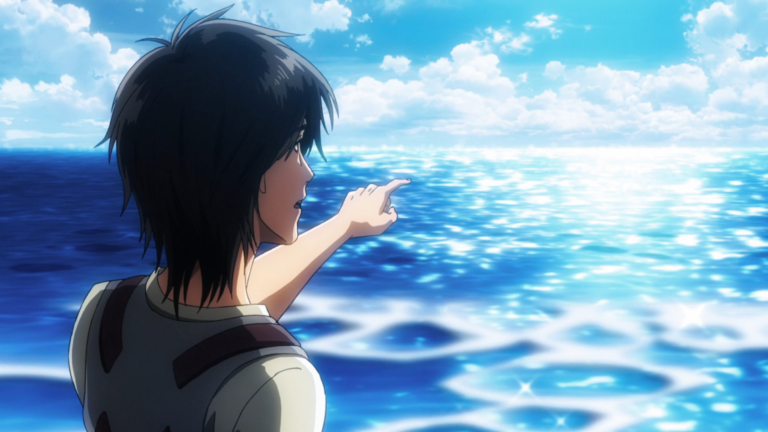

# 

  

 <h2 align="center">"Beyond the sea is freedom". "海の向こうには自由がある."  </h2>

### 🌸 About me
Hello, I'm Hải Đăng (Tatsumi). I currently learing at PTIT and I am a technology enthusiast and a student who loves building software and diving deep into computer systems.

* 🚀 **Aspirations:** Learning how systems scale, optimizing environments, and looking towards paths like Cloud and DevOps.
* 🗣️ **Languages:** Vietnamese, English and Japanese.
* 🎮 **Interests:** Coding, system performance, light novel, manga and anime.

### 💻 Tech stack

* **Languages:** JavaScript, Python, HTML/CSS, Java
* **Databases:** MySQL, SQL Server
* **Frameworks:** Next JS ,JSX
* **Tools:** Git, VS code, Docker 

### 🌐 You can find me on

